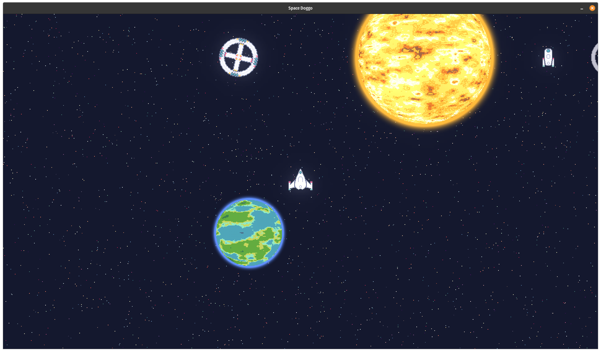
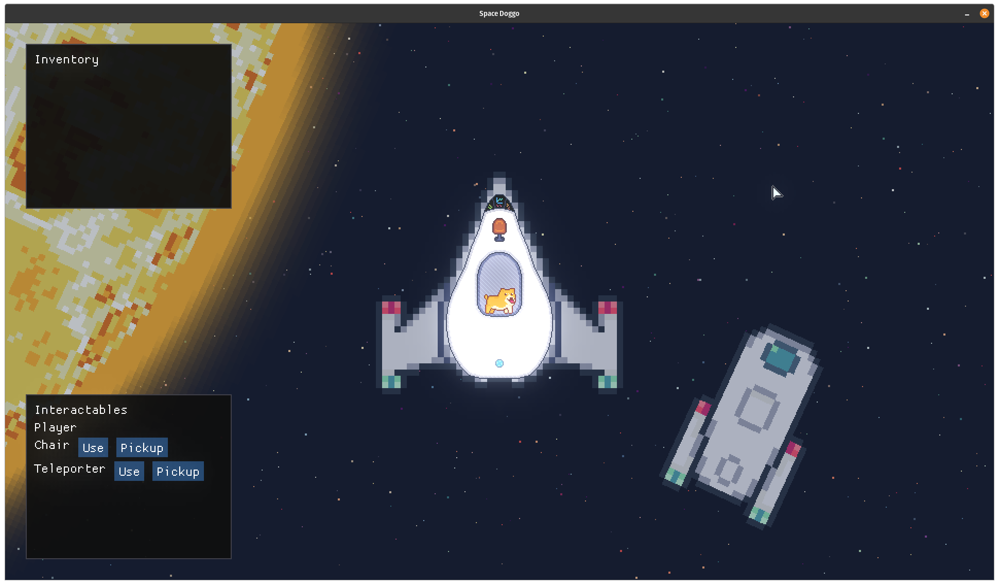

# Simple Space (Game)
A simple space game written in C++ and SFML.

## Screenshots

These screenshots were take in November 2020.




## Devlog

I've been keeping a video devlog series that chronicles the changes over time and explains some of the features in a bit more detail.

[YouTube Playlist](https://www.youtube.com/playlist?list=PLTf8ZRLo3EcP7A2US2CpGMTsEW_Kzezx8)

## Dependencies

Ubuntu
```sh
sudo apt install clang build-essential cmake libudev-dev libxrandr-dev libopenal-dev libvorbis-dev libfreetype-dev libglew-dev libbox2d-dev doctest-dev
```

Fedora
```sh
sudo dnf install clang libXrandr-devel cmake libvorbis-devel glew-devel doctest-devel Box2D-devel systemd-devel openal-soft-devel freetype-devel
```

You will also need to pull the git submodules.
The only dependencies at the moment is a custom fork of `SFML` and `tmxlite`.

The custom fork of `SFML` is for simplifying some of the operations and for removing some unused audio and image formats.

`tmxlite` is a [Tiled](https://www.mapeditor.org/) map parser, which is used for planet surfaces.

```sh
git submodule init
git submodule update
```

To run just execute `run.sh`.

## Author

Alan Lawrey